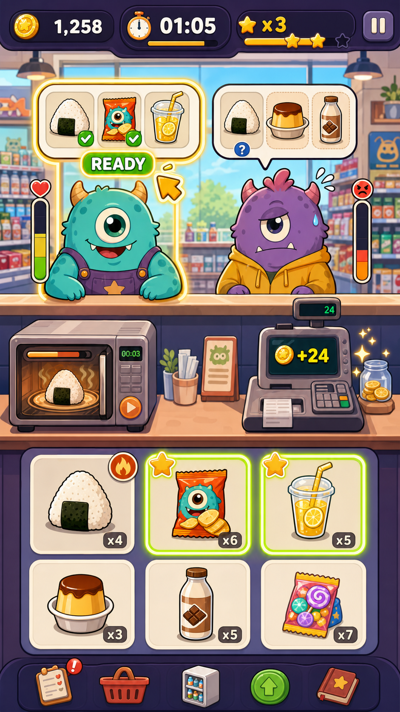

# 经营页美术与 UI 目标图板

更新时间：2026-06-25

## 目的

这份文档是经营页美术和 UI 的可视化目标入口。后续美术/UX、产品和开发都以这里的目标图为准，不再只用文字描述“更好看”或“更商业化”。

当前目标不是立刻一比一还原概念图，而是明确：

- 最终画面应该接近什么气质。
- 当前运行画面和目标图差在哪里。
- 哪些 UI 组件需要重新设计或补图。
- 哪些现有资源可以保留，哪些只是临时可用。

## 当前整屏目标图

当前经营页商业化目标基准已更新为 V2：



图片路径：

```text
assets/ui/mockups/gameplay-main-order-bubble-ready-v2.png
```

目标图传达的核心方向：

- 画面像一个完整的怪兽便利店，而不是功能面板堆叠。
- 顶部 HUD、顾客区、工作台、商品区分层清楚。
- 商品、顾客、设备都使用统一的粗描边、圆润比例和高饱和可爱色。
- 独立交付托盘已删除，订单气泡承担 READY 与交付确认。
- 微波炉、订单气泡、收银台和商品状态通过图标和动效表达，不依赖长文字。
- 手机截图第一眼能看出卖点：怪兽顾客、便利店商品、时间压力、订单服务。

## 历史参考图

旧目标图仍可作为早期风格参考，但不再作为当前玩法目标：


图片路径：

```text
archive/art-legacy-2026-06-27/assets/ui/mockups/gameplay-main-dual-customer-v2.png
```

旧图的问题：

- 暗示独立交付托盘、传送带或多备餐位。
- 暗示右侧 `DELIVERED` 独立交付面板。
- 暗示多个热食或加工缓存。

这些方向暂不作为 V1 目标。

## 当前运行图

最新托盘修复后的运行截图：


图片路径：

```text
tmp/qa-fix-after-snack-click.png
```

这张图证明当前玩法闭环已可运行：商品进入托盘，托盘 READY，点击后才收钱。但从商业化视觉目标看，仍然只是“功能可读”，还不是“上线截图”。

## 整体差距判断

| 区域 | 目标图状态 | 当前状态 | 差距等级 | 下一步方向 |
| --- | --- | --- | --- | --- |
| 整体画面 | 完整插画式便利店空间 | 可玩界面，局部仍像程序 UI 拼接 | 高 | 统一经营页视觉结构 |
| 顶部 HUD | 大图标、大数字、少文字、强质感 | 信息可读，但图标和面板风格仍混合 | 中 | 固定 HUD 图标和数字样式 |
| 顾客区 | 顾客、订单气泡、耐心条形成强焦点 | 顾客可爱，但订单气泡和背景层级还弱 | 中 | 重做订单气泡与顾客舞台 |
| 工作台 | 微波炉、订单气泡 READY、收银区形成闭环 | 当前可用，但设备区像运行时拼装 | 高 | 设备、订单 READY、收银台统一成一条服务动线 |
| 订单交付 | 订单气泡是 READY 与交付确认核心 | 当前仍按托盘 READY 表达 | 高 | 删除独立交付托盘，改为订单气泡 READY 交付 |
| 商品卡 | 大图标、少文字、角标明确 | 商品图标不错，但卡片信息仍偏功能面板 | 中 | 商品卡从“说明牌”转为“货架商品卡” |
| 底部说明 | 用图例解释状态 | 当前仍有较多中文标签和状态文字 | 中 | 状态优先图标化，文字降级 |
| 美术资源 | V2 风格统一度更高 | 当前资源混合多轮临时资产 | 高 | 基本按全量重做规划，只保留少量临时占位 |

## 组件目标

### 1. HUD 目标

目标图中的 HUD 特征：

- 金币、时间、连击/星级、暂停都是大图标 + 大数字。
- 面板统一为深色或高对比色底，圆润厚描边。
- 时间是最高压力信息，居中突出。

当前需要做：

- 固定金币/营业额、时间、满意度/连击、暂停按钮四类 HUD 样式。
- 减少常驻中文标签，例如把“营业额”替换为图标或小标题。
- 数字应比标签更大，避免截图里信息读不出来。

目标图需求：

- HUD 整条目标图。
- 单个 HUD 面板目标图：金币、时间、星级/连击、暂停。

### 2. 顾客区目标

目标图中的顾客区特征：

- 双顾客是画面主角，占据上半屏视觉中心。
- 当前服务顾客有清楚编号/边框/高亮。
- 订单气泡里的商品大而清楚，耐心条贴近订单。
- 顾客表情和订单压力直接关联。

当前需要做：

- 保留现有怪兽角色方向，但统一大小、站位和订单气泡关系。
- 当前顾客高亮要更像目标图里的“正在服务 1/2”，而不是只有边框变化。
- 订单气泡减少装饰噪声，强化商品图标和耐心条。

目标图需求：

- 双顾客区目标图。
- 当前顾客和非当前顾客两种订单气泡。
- 急躁、生气、开心三种状态在经营页中的实际截图级目标。

### 3. 工作台目标

目标图中的工作台特征：

- 微波炉、订单 READY、收银反馈共同组成工作台流程。
- 微波炉 READY 明显发光。
- 当前顾客订单气泡承担“正在组装订单”和 READY 交付。
- 交付成功后订单气泡、顾客和收银台联动反馈。

当前需要做：

- 把微波炉、订单气泡 READY、收银台统一到同一套服务动线。
- 独立交付托盘不再作为当前目标。
- 收银台目前承担营业额显示，后续要和付款反馈、金币飞行动效统一。

目标图需求：

- 工作台整区目标图。
- 微波炉 idle/heating/ready 三状态目标。
- 订单气泡 missing/partial/ready/done/error 五状态目标。
- 收银台 idle/collecting 两状态目标。

### 4. 商品卡目标

目标图中的商品卡特征：

- 商品图标非常大，识别优先于文字。
- 星星、火焰等状态角标足够醒目。
- 卡片像货架商品，而不是表格按钮。
- 底部图例解释状态，卡片本身少文字。

当前需要做：

- 商品图标可以保留，继续强化统一画布和描边。
- 商品卡需要减少“货架 3”等文字占比。
- 锁定、缺货、需要加热、当前需要等状态要统一为图标语言。

目标图需求：

- 普通商品卡目标图。
- 当前订单需要的商品卡目标图。
- 需要加热商品卡目标图。
- 售罄/未解锁商品卡目标图。

### 5. 订单 READY 交付目标

目标图中的订单交付逻辑特征：

- 玩家能一眼知道当前顾客订单气泡是组装与交付确认区。
- 点击商品后，商品在订单气泡对应槽位里点亮或勾选。
- 全部备齐后，当前顾客订单气泡进入 READY。
- 点击 READY 订单气泡或当前顾客区域完成交付。
- 完成后订单气泡 DONE、顾客开心、收银台入账。

当前需要做：

- 删除独立交付托盘。
- 保留“备齐后需要确认交付”的规则，但确认入口迁移到订单气泡/当前顾客。
- 强化订单状态：missing、partial、ready、error、done。
- 订单 READY 不能只靠文字，要靠发光、勾、箭头或动效。

目标图需求：

- 订单气泡五状态组件目标图。
- 商品从货架飞入订单气泡的动效关键帧。
- READY 订单点击后的商品飞向顾客或收银反馈关键帧。

## P0 目标图清单

| 编号 | 目标图 | 必要性 | 现有参考 | 下一步 |
| --- | --- | --- | --- | --- |
| IMG-001 | 经营页整屏目标图 V2 | 必须 | `assets/ui/mockups/gameplay-main-order-bubble-ready-v2.png` | 已确认为当前目标 |
| IMG-002 | 当前运行截图对比图 | 必须 | `tmp/qa-fix-after-snack-click.png` | 后续可生成并排对比图 |
| IMG-003 | HUD 目标组件图 | 必须 | V2 目标图顶部 | 需要按 V2 重做 |
| IMG-004 | 订单气泡目标组件图 | 必须 | V2 目标图上半屏 | 需要按 READY 交付重做 |
| IMG-005 | 商品卡目标组件图 | 必须 | V2 目标图底部 | 需要按 V2 重做 |
| IMG-006 | 订单 READY 状态目标图 | 必须 | V2 目标图当前顾客订单 | 需要新增状态板 |
| IMG-007 | 工作台目标图 | 必须 | V2 目标图中部 | 需要拆微波炉/收银台/反馈 |
| IMG-008 | 结算反馈目标图 | 次要 | 暂无整屏目标 | 阶段 2 后补 |
| IMG-009 | 全量资源重做清单 | 必须 | V2 目标图 | 需要进入 A-002 |

## 当前结论

经营页美术/UI 的第一目标不是继续添加新功能，而是让现有核心闭环在画面上更像目标图：

```text
怪兽顾客提出订单
玩家从商品区选择商品
商品进入订单气泡或微波炉
订单气泡 READY 后交付
顾客反馈并收钱
```

V2 目标图已经证明这个方向有更高商业化潜力；当前运行图证明玩法闭环已经能跑。下一步应进入 `A-002：P0资源清单`，按 V2 将美术资源视为基本全量重做，并标注哪些可以临时复用。

## 下一步建议

美术/UX 角色下一次开工：

```text
【当前角色】美术/UX
【这次要做】经营页视觉目标与差距清单
【解决什么问题】把目标图和当前运行图的差距拆成可执行任务
【为什么更接近商业化上线目标】让经营页截图从“能玩”接近“能卖”
【产出物】docs/ART_UX_GAMEPLAY_PAGE_TARGET.md
【验收标准】每个差距都能对应到一个资源、布局或动效任务
```
